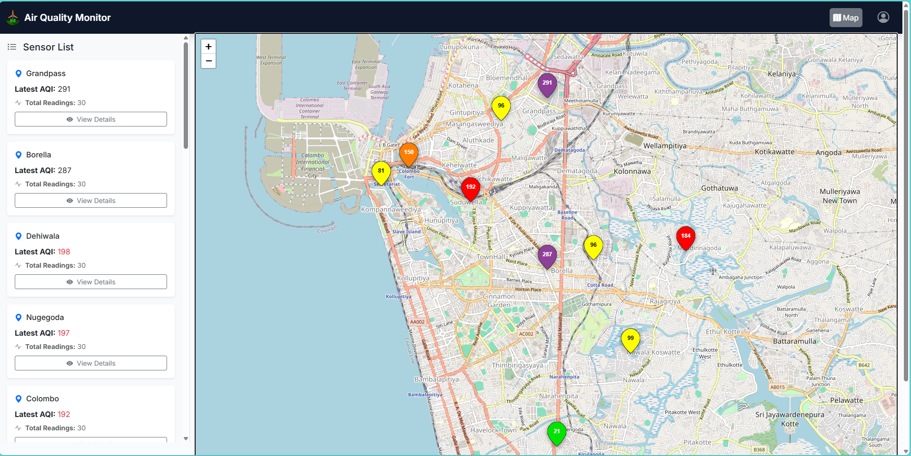
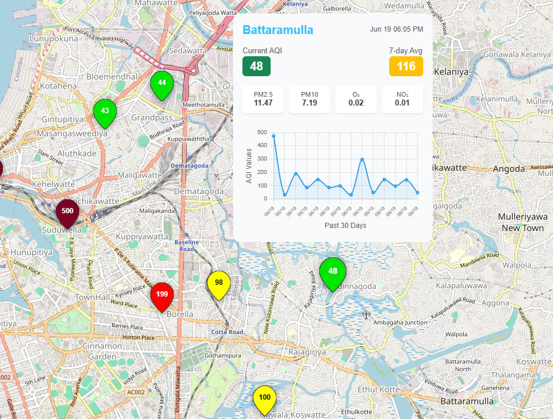
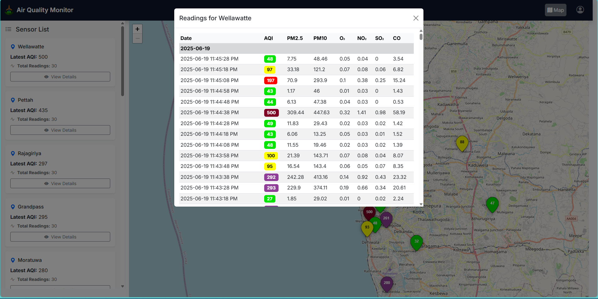
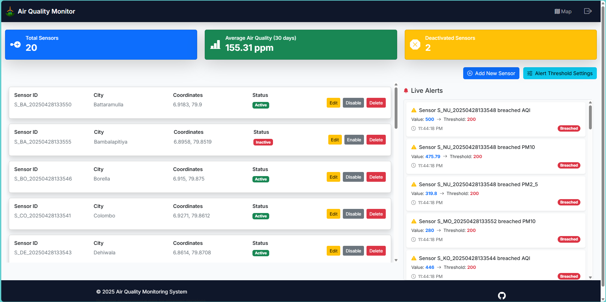

# Air Quality Display and Management Website

## Project Overview

This is an interactive web application designed for real-time air quality monitoring within the Colombo district (Sri Lanka). Users can interactively view detailed air quality information, while administrators have the capability to manage sensor data, and super administrators can control critical website functionalities including user management.

## Features

- **Interactive Air Quality Monitoring:** Users can view detailed air quality data for the Colombo district.
- **Admin Panel:** Manage and update sensor data.
- **Super Admin Panel:** Oversee critical website functionalities and user roles.
- **User-Friendly Interface:** Designed for intuitive navigation and data visualization.

## Technologies Used

- **Backend:** ASP.NET Core (C#)
- **Frontend:** Razor Pages
- **Database:** SQL Server (managed with Entity Framework Core)
- **Architecture:** Model-View-Controller (MVC)

## Installation Guide

To set up and run this project locally, follow these steps:

### Prerequisites

- **Visual Studio 2022:** Ensure you have Visual Studio 2022 installed with the following workloads:
  - **"Data storage and processing"**
  - **"ASP.NET and web development"**
- **SQL Server:** A local or remote SQL Server instance for the database.

### Setup Steps

1.  **Clone the Repository:**

    ```bash
    git clone https://github.com/Mithila001/Air_Quality_Monitoring_Website.git
    ```

    ```bash
    cd Air_Quality_Monitoring_Website
    ```

2.  **Open in Visual Studio:**

    - Open Visual Studio 2022.
    - Go to `File` > `Open` > `Project/Solution...`
    - Navigate to the cloned repository and open the solution file (`.sln` file) located at `\Air_Quality_Monitoring_Website\SDTP_Project1\SDTP_Project1.sln` (adjust path if your solution file is directly in the root).

3.  **Configure Database Connection:**

    - Navigate to the `\Air_Quality_Monitoring_Website\SDTP_Project1\` directory.
    - Open the `appsettings.json` file.
    - Locate the `"DefaultConnection"` string within the `"ConnectionStrings"` section.
    - **Replace the placeholder with your actual SQL Server connection string.**
      Example:
      ```
      {
        "ConnectionStrings": {
          "DefaultConnection": "Server=your_server_name;Database=YourAirQualityDB;Integrated Security=True;TrustServerCertificate=True;"
          // Or for SQL Server Express:
          // "DefaultConnection": "Server=(localdb)\\mssqllocaldb;Database=YourAirQualityDB;Integrated Security=True;TrustServerCertificate=True;"
        }
        // ... other settings
      }
      ```
      _Make sure to replace `your_server_name` (e.g., `.` or `localhost\SQLEXPRESS`) and `YourAirQualityDB` with your desired database name._

4.  **Apply Database Migrations:**

    - In Visual Studio, open the **Package Manager Console** (`Tools` > `NuGet Package Manager` > `Package Manager Console`).
    - Ensure the "Default project" dropdown in the Package Manager Console is set to `SDTP_Project1` (or your main project containing the `DbContext`).
    - Run the following commands to apply the database migrations and create the database schema:
      ```powershell
      Update-Database
      ```
    - _(If this is the first time setting up migrations or if you need to create a new one, you might use `Add-Migration [MigrationName]` first, followed by `Update-Database`. However, `Update-Database` alone should apply all pending migrations.)_

5.  **Run the Application:**
    - Press `F5` or click the "IIS Express" button in Visual Studio to run the application.
    - The application should open in your default web browser.

## Screenshots

### Home Page





### System Admin



### Super Admin


---
